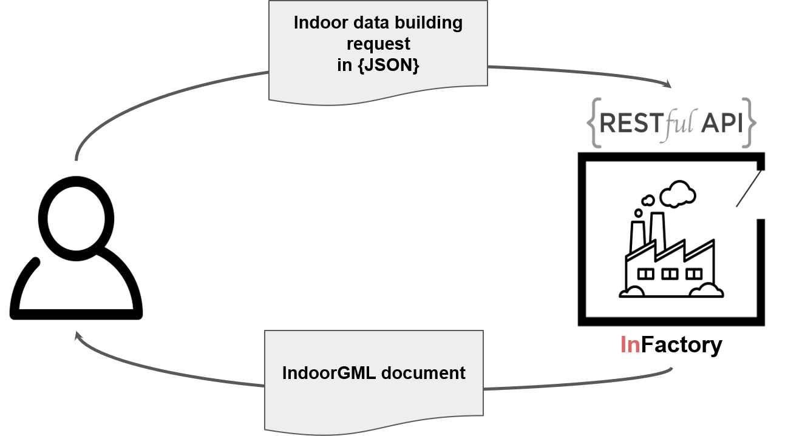
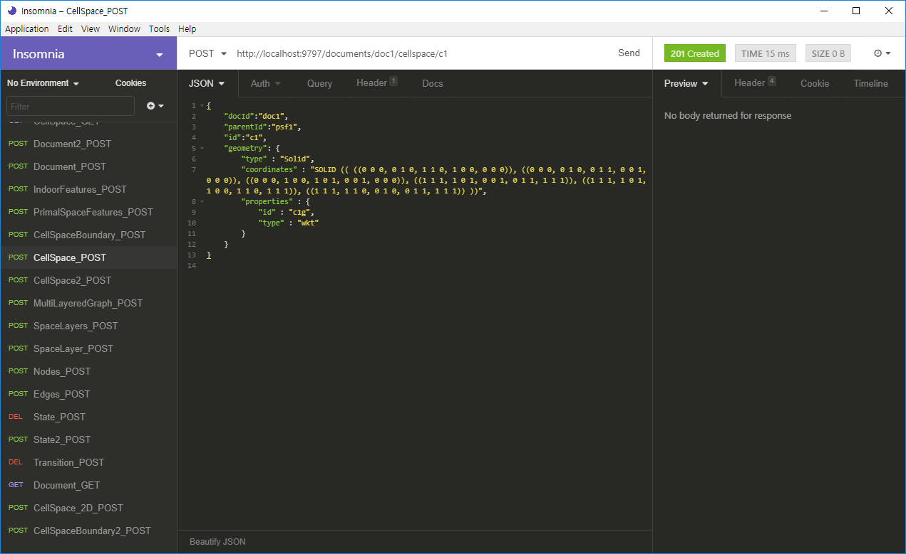
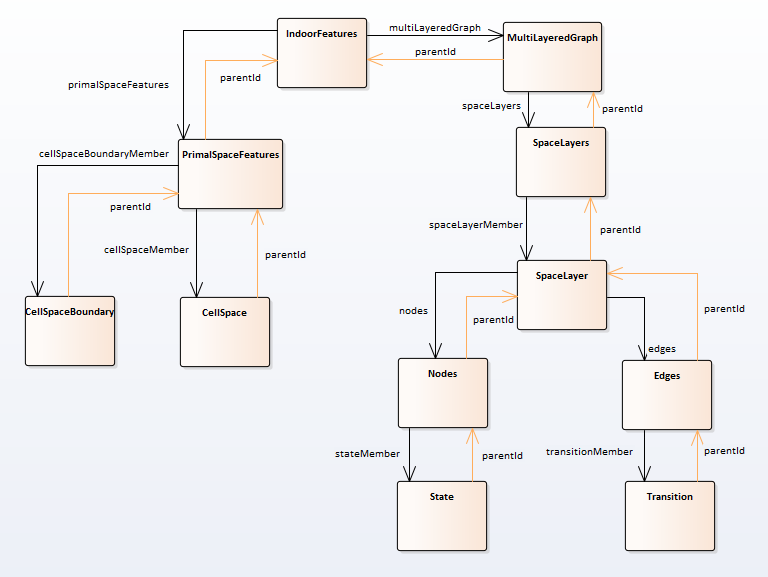

What is InFactory?
==================

## Purpose of InFactoy

InFactory is a RESTful API server that constructs [IndoorGML](http://www.opengeospatial.org/standards/indoorgml) documents using indoor spatial data of users based on Restful API. It is possible to generate the data of the attributes and geometry data of each element in IndoorGML by sending these information to InFactory in simple JSON format.



IndoorGML is a standard of Open Geospatial Consortium for expressing indoor space data in XML document. Before implementation of InFactory, IndoorGML document is hard to create because of the encoding of XML and understanding the schema of IndoorGML. InFactory solves those problem to support user to create IndoorGML easily.  


## RESTful API SERVER


The users can use InFactory regardless of the development environment via RESTful API of InFactory. RESTful API is based on CRUD function on IndoorGML complex features. Users can create IndoorGML by writing their own indoor space information according to the predefined JSON(Javascript Object Notation) based form.

All IndoorGML complex features can be represented by this JSON format. The details are described at the below part.


First of all, the users need to implement their own client program which sends HTTP requests to the server. If there is no client program, it is recommended to use [InSomnia](https://insomnia.rest/), which is a debugging tool for RESTful API by by communicating HTTP request to the server program.




### Quick Start

#### Terms
* POST: Request to create a new entity including a document and the features in IndoorGML
* GET:  Retrieve information from InFactory server.
* PUT: Request to update the existing entity. InFactory supports fully-patched Update.
* DELETE: Request to remove a resource; however, the resource does not have to be removed immediately.

#### Coverage of this wiki

* Quick start for POST, GET, PUT, DELETE
* The form of the HTTP request including the form of url, body, and the response code.
* The sample code based on HTML and Javascript. Copy and paste it at a blank file, save it, and open it.

#### 1. How to run InFactory server
After installing Infactory as explained in [Readme](https://github.com/STEMLab/InFactory/blob/master/README.md),
you have to make InFactory server ready to receive the HTTP requests from your client.

```
$ mvn clean install
$ mvn jetty:run "-Djetty.port=9797"
```

#### 2. Creating an IndoorGML Document
You can create an IndoorGML document by sending a set of HTTP requests to the InFactory server. The creation procedure is in general composed of the following steps;
* Step 1: Creating IndoorGML document (POST request)
* Step 2: Creating IndoorGML Features (POST request)
* Step 3: Downloading IndoorGML document (GET request)

The detail for step 1 and 2 is described at the section 3.POST and the detail for step 3 is described at the section 4.GET.

#### 3. POST
First of all, you have to give the name of IndoorGML document as a URL, for example, `http://localhost:9797/documents/doc1`. Although the users of InFactory do not need to care the sequence of feature creations and the IndoorGML class hierarchy, the key features shown in figure 1 should not be missing anyway.
```
IndoorFeatures
              |-> PrimalSpaceFeatures
                                    |-> CellSpace
                                    |-> CellSpaceBoundary
              |-> MultiLayeredGraph -> SpaceLayers -> SpaceLayer
                                                                |-> Nodes -> State
                                                                |-> Edges -> Transition
```
Figure 1. Basic IndoorGML Hierarchical Structure

When the users send GET request to the InFactory server, the server generates the IndoorGML document by arranging the hierarchical structure of the document.

##### 3.1.  Create Document

Before creating the features of IndoorGML, the users need to create the instance of IndoorGML document at the server of InFactory first.
When the server of InFactory creats the IndoorGML document, the identifier of the document is needed. Usually the name of the IndoorGML document is used as the identifier of the document.  

###### URL

`http://{baseurl}/documents/{id}`

-	 `{id}` : alphanumeric id which starts as a alphabet

###### Response

-	Status : 201 CREATED / 404 NOT FOUND
-	Content-Type : None

###### Sample Code for Javascript

```html
<!DOCTYPE html>
<html>
<body>

<h2>The XMLHttpRequest Object</h2>

<button type="button" onclick="loadDoc()">Request data</button>

<p id="demo"></p>

<script>
function loadDoc() {
  var xhttp = new XMLHttpRequest();
  xhttp.onreadystatechange = function() {
    if (this.readyState == 4 && this.status == 201) {
      document.getElementById("demo").innerHTML = this.responseText;
    }
  };
  var url = 'http://localhost:9797/documents/doc1';
  var contentType = 'application/json';
 var data = {
    "docId":"doc1"
}
  xhttp.open("POST", url, true);
  xhttp.setRequestHeader("Content-type", contentType);
  xhttp.send(JSON.stringify(data));
}
</script>

</body>
</html>

```

##### 3.2. Create Indoorfeatures

After the instance of the IndoorGML document is created at the server of InFactory, the features including Indoorfeatures feature can be created.
In this part, how to send the request for creating IndoorFeatures will be described.
The other features such as PrimalSpaceFeatures and CellSpace can be created similar with creating Indoorfeatures. The example of creating those two types of features are also introduced at the section 3.3 and 3.4.

###### URL

`https://{baseurl}/documents/{docId}/indoorfeatures/{id}`

-	`{docId}` : alphanumeric id which starts as a alphabet
-	`{id}` : alphanumeric id which starts as a alphabet

###### Body

-	Content-Type : "application/json"
-	Accept : "application/json"
- The content of the body
```json5
{
    "docId":"doc1", //the id of the document which this elements are contained.
    "id":"lf1" //the id of the feature.
}
```

###### Response

-	Status : 201 created / 404 NOT FOUND
-	Content-Type : None

##### 3.3. Create PrimalSpaceFeatures

###### URL

`https://{baseurl}/documents/{docId}/primalspacefeatures/{id}`

-	`{docId}` : alphanumeric id which starts as a alphabet
-	`{id}` : alphanumeric id which starts as a alphabet

###### Example of the url

```
$ POST http://localhost:9797/documents/doc1primalspacefeatures/pf1
```

###### Body

-	Content-Type : "application/json"
-	Accept : "application/json"
- The content of the body
```json5
{
    "docId":"doc1",
    "parentId":"lf1",
    "id":"psf1"
}
```

###### Response

-	Status : 201 created / 404 NOT FOUND
-	Content-Type : None

##### 3.4. Create CellSpace

###### URL

`https://{baseurl}/documents/{docId}/cellspace/{id}`

-	`{docId}` : alphanumeric id which starts as a alphabet
-	`{id}` : alphanumeric id which starts as a alphabet

###### Body

-	Content-Type : "application/json"
-	Accept : "application/json"
- The content of the body
```json5
{
    "docId":"doc1",
    "parentId":"psf1",
    "id":"c1",
    "geometry": {
        "type" : "Solid",
        "coordinates" : "SOLID (( ((0 0 0, 0 1 0, 1 1 0, 1 0 0, 0 0 0)), ((0 0 0, 0 1 0, 0 1 1, 0 0 1, 0 0 0)), ((0 0 0, 1 0 0, 1 0 1, 0 0 1, 0 0 0)), ((1 1 1, 1 0 1, 0 0 1, 0 1 1, 1 1 1)), ((1 1 1, 1 0 1, 1 0 0, 1 1 0, 1 1 1)), ((1 1 1, 1 1 0, 0 1 0, 0 1 1, 1 1 1)) ))",
        "properties" : {
            "id" : "c1g",
            "type" : "wkt"
        }
    }
}
```

###### Response

-	Status : 201 created / 404 NOT FOUND
-	Content-Type : None

###### Sample code for Javascript

```html
<!DOCTYPE html>
<html>
<body>

<h2>The XMLHttpRequest Object</h2>

<button type="button" onclick="loadDoc()">Request data</button>

<p id="demo"></p>

<script>
function loadDoc() {
  var xhttp = new XMLHttpRequest();
  xhttp.onreadystatechange = function() {
    if (this.readyState == 4 && this.status == 201) {
      document.getElementById("demo").innerHTML = this.responseText;
    }
  };
  var url = 'http://localhost:9797/documents/doc1/cellspace/c1';
  var contentType = 'application/json';
 var data = {
    "docId":"doc1",
    "parentId":"psf1",
    "id":"c1",
    "geometry": {
        "type" : "Solid",
        "coordinates" : "SOLID (( ((0 0 0, 0 1 0, 1 1 0, 1 0 0, 0 0 0)), ((0 0 0, 0 1 0, 0 1 1, 0 0 1, 0 0 0)), ((0 0 0, 1 0 0, 1 0 1, 0 0 1, 0 0 0)), ((1 1 1, 1 0 1, 0 0 1, 0 1 1, 1 1 1)), ((1 1 1, 1 0 1, 1 0 0, 1 1 0, 1 1 1)), ((1 1 1, 1 1 0, 0 1 0, 0 1 1, 1 1 1)) ))",
        "properties" : {
            "id" : "c1g",
            "type" : "wkt"
        }
    }
}
  xhttp.open("POST", url, true);
  xhttp.setRequestHeader("Content-type", contentType);
  xhttp.send(JSON.stringify(data));
}
</script>

</body>
</html>

```

#### 4. GET

After creating the IndoorGML document, the users can download the document by the InFactory server.
Or the users can get each features of IndoorGML elements.
In this section, how to get the IndoorGML document and the single CellSpace features.

###### Example code of Javascript

```html
<!DOCTYPE html>
<html>
<body>

<h2>The XMLHttpRequest Object</h2>

<button type="button" onclick="loadDoc()">Request data</button>

<p id="demo"></p>

<script>
function loadDoc() {
  var xhttp = new XMLHttpRequest();
  xhttp.onreadystatechange = function() {
    if (this.readyState == 4 && this.status == 302) {
      console.log(this.responseText);
    }
  };
  var url = 'http://localhost:9797/documents/doc1/';
  var contentType = 'application/json';

  xhttp.open("GET", url, true);
  xhttp.setRequestHeader("Content-type", contentType);
  xhttp.send(0);
}
</script>

</body>
</html>
```


##### 4.1. GET documents

When the users send this request to the InFactory server then the server return the XML document. If there is schema error at the data in the server, then the predefined error will be returned.

###### URL

`https://{baseurl}/documents/{docId}`

-	`{docId}` : alphanumeric id which starts as a alphabet
-	`{id}` : alphanumeric id which starts as a alphabet

###### Body

-	Content-Type : None
-	Accept : None

###### Response

-	Status : 302 FOUND / 404 NOT FOUND
-	Content-Type : "application/xml"

```xml
<IndoorFeatures
    xmlns:gml="http://www.opengis.net/gml/3.2"
    xmlns:xlink="http://www.w3.org/1999/xlink"
    xmlns="http://www.opengis.net/indoorgml/1.0/core"
    xmlns:navi="http://www.opengis.net/indoorgml/1.0/navigation"
    xmlns:xsi="http://www.w3.org/2001/XMLSchema-instance" gml:id="lf1" xsi:schemaLocation="http://www.opengis.net/indoorgml/1.0/core http://schemas.opengis.net/indoorgml/1.0/indoorgmlcore.xsd http://www.opengis.net/indoorgml/1.0/navigation http://schemas.opengis.net/indoorgml/1.0/indoorgmlnavi.xsd">
    <gml:boundedBy xsi:nil="true"/>
    <primalSpaceFeatures>
        <PrimalSpaceFeatures gml:id="psf1">
            <gml:boundedBy xsi:nil="true"/>
            <cellSpaceMember>
                <CellSpace gml:id="c1">
                    <gml:boundedBy xsi:nil="true"/>
                    <cellSpaceGeometry>
                        <Geometry3D>
                            <gml:Solid gml:id="c1g">
                                <gml:exterior>
                                    <gml:Shell>
                                        <gml:surfaceMember>
                                            <gml:Polygon>
                                                <gml:exterior>
                                                    <gml:LinearRing>
                                                        <gml:pos srsDimension="3">0.0 0.0 0.0</gml:pos>
                                                        <gml:pos srsDimension="3">0.0 1.0 0.0</gml:pos>
                                                        <gml:pos srsDimension="3">1.0 1.0 0.0</gml:pos>
                                                        <gml:pos srsDimension="3">1.0 0.0 0.0</gml:pos>
                                                        <gml:pos srsDimension="3">0.0 0.0 0.0</gml:pos>
                                                    </gml:LinearRing>
                                                </gml:exterior>
                                            </gml:Polygon>
                                        </gml:surfaceMember>
                                        <gml:surfaceMember>
                                            <gml:Polygon>
                                                <gml:exterior>
                                                    <gml:LinearRing>
                                                        <gml:pos srsDimension="3">0.0 0.0 0.0</gml:pos>
                                                        <gml:pos srsDimension="3">0.0 1.0 0.0</gml:pos>
                                                        <gml:pos srsDimension="3">0.0 1.0 1.0</gml:pos>
                                                        <gml:pos srsDimension="3">0.0 0.0 1.0</gml:pos>
                                                        <gml:pos srsDimension="3">0.0 0.0 0.0</gml:pos>
                                                    </gml:LinearRing>
                                                </gml:exterior>
                                            </gml:Polygon>
                                        </gml:surfaceMember>
                                        <gml:surfaceMember>
                                            <gml:Polygon>
                                                <gml:exterior>
                                                    <gml:LinearRing>
                                                        <gml:pos srsDimension="3">0.0 0.0 0.0</gml:pos>
                                                        <gml:pos srsDimension="3">1.0 0.0 0.0</gml:pos>
                                                        <gml:pos srsDimension="3">1.0 0.0 1.0</gml:pos>
                                                        <gml:pos srsDimension="3">0.0 0.0 1.0</gml:pos>
                                                        <gml:pos srsDimension="3">0.0 0.0 0.0</gml:pos>
                                                    </gml:LinearRing>
                                                </gml:exterior>
                                            </gml:Polygon>
                                        </gml:surfaceMember>
                                        <gml:surfaceMember>
                                            <gml:Polygon>
                                                <gml:exterior>
                                                    <gml:LinearRing>
                                                        <gml:pos srsDimension="3">1.0 1.0 1.0</gml:pos>
                                                        <gml:pos srsDimension="3">1.0 0.0 1.0</gml:pos>
                                                        <gml:pos srsDimension="3">0.0 0.0 1.0</gml:pos>
                                                        <gml:pos srsDimension="3">0.0 1.0 1.0</gml:pos>
                                                        <gml:pos srsDimension="3">1.0 1.0 1.0</gml:pos>
                                                    </gml:LinearRing>
                                                </gml:exterior>
                                            </gml:Polygon>
                                        </gml:surfaceMember>
                                        <gml:surfaceMember>
                                            <gml:Polygon>
                                                <gml:exterior>
                                                    <gml:LinearRing>
                                                        <gml:pos srsDimension="3">1.0 1.0 1.0</gml:pos>
                                                        <gml:pos srsDimension="3">1.0 0.0 1.0</gml:pos>
                                                        <gml:pos srsDimension="3">1.0 0.0 0.0</gml:pos>
                                                        <gml:pos srsDimension="3">1.0 1.0 0.0</gml:pos>
                                                        <gml:pos srsDimension="3">1.0 1.0 1.0</gml:pos>
                                                    </gml:LinearRing>
                                                </gml:exterior>
                                            </gml:Polygon>
                                        </gml:surfaceMember>
                                        <gml:surfaceMember>
                                            <gml:Polygon>
                                                <gml:exterior>
                                                    <gml:LinearRing>
                                                        <gml:pos srsDimension="3">1.0 1.0 1.0</gml:pos>
                                                        <gml:pos srsDimension="3">1.0 1.0 0.0</gml:pos>
                                                        <gml:pos srsDimension="3">0.0 1.0 0.0</gml:pos>
                                                        <gml:pos srsDimension="3">0.0 1.0 1.0</gml:pos>
                                                        <gml:pos srsDimension="3">1.0 1.0 1.0</gml:pos>
                                                    </gml:LinearRing>
                                                </gml:exterior>
                                            </gml:Polygon>
                                        </gml:surfaceMember>
                                    </gml:Shell>
                                </gml:exterior>
                            </gml:Solid>
                        </Geometry3D>
                    </cellSpaceGeometry>
                </CellSpace>
            </cellSpaceMember>
        </PrimalSpaceFeatures>
    </primalSpaceFeatures>
</IndoorFeatures>

```
Figure 2. the XML document received as the result of the GET request.

##### 4.2. GET CellSpace

When the server of InFactory receives the request which asks the server to return the feature of IndoorGML, the server will return the data of the feature in the JSON format defined at [JSON format](https://github.com/STEMLab/InFactory/wiki/JSON-format).


###### URL

`https://{baseurl}/documents/{docId}/cellspace/{id}`

-	`{docId}` : alphanumeric id which starts as a alphabet
-	`{id}` : alphanumeric id which starts as a alphabet

###### Body

-	Content-Type : None
-	Accept : None

###### Response

-	Status : 302 FOUND / 404 NOT FOUND
-	Content-Type : "application/json"

```json5
{
    "docId":"doc1",
    "parentId":"psf1",
    "id":"c1",
    "geometry": {
        "type" : "Solid",
        "coordinates" : "SOLID (( ((0 0 0, 0 1 0, 1 1 0, 1 0 0, 0 0 0)), ((0 0 0, 0 1 0, 0 1 1, 0 0 1, 0 0 0)), ((0 0 0, 1 0 0, 1 0 1, 0 0 1, 0 0 0)), ((1 1 1, 1 0 1, 0 0 1, 0 1 1, 1 1 1)), ((1 1 1, 1 0 1, 1 0 0, 1 1 0, 1 1 1)), ((1 1 1, 1 1 0, 0 1 0, 0 1 1, 1 1 1)) ))",
        "properties" : {
            "id" : "c1g",
            "type" : "wkt"
        }
    }
}
```
Figure 3. The JSON data of the CellSpace feature received as the result of the request.

#### 5. PUT

The server of InFactory fully updates the contents of the existing features when the server receives the request.
The users need to write full content of the feature when the users send PUT request to the server.

###### Example code of Javascript

```html
<!DOCTYPE html>
<html>
<body>

<h2>The XMLHttpRequest Object</h2>

<button type="button" onclick="loadDoc()">Request data</button>

<p id="demo"></p>

<script>
function loadDoc() {
  var xhttp = new XMLHttpRequest();
  xhttp.onreadystatechange = function() {
    if (this.readyState == 4 && this.status == 201) {
      document.getElementById("demo").innerHTML = this.responseText;
    }
  };
  var url = 'http://localhost:9797/documents/doc1';
  var contentType = 'application/json';
 var data = {
    "docId":"doc1"
}
  xhttp.open("PUT", url, true);
  xhttp.setRequestHeader("Content-type", contentType);
  xhttp.send(JSON.stringify(data));
}
</script>

</body>
</html>

```
###### URL

`https://{baseurl}/documents/{docId}/cellspace/{id}`

-	`{docId}` : alphanumeric id which starts as a alphabet
-	`{id}` : alphanumeric id which starts as a alphabet

###### Body

-	Content-Type : "application/json"
-	Accept : "application/json"
- The content of the body

```json5
{
    "docId":"doc1",
    "parentId":"psf1",
    "id":"c1",
    "geometry": {
        "type" : "Solid",
        "coordinates" : "SOLID (( ((0 0 0, 0 1 0, 1 1 0, 1 0 0, 0 0 0)), ((0 0 0, 0 1 0, 0 1 1, 0 0 1, 0 0 0)), ((0 0 0, 1 0 0, 1 0 1, 0 0 1, 0 0 0)), ((1 1 1, 1 0 1, 0 0 1, 0 1 1, 1 1 1)), ((1 1 1, 1 0 1, 1 0 0, 1 1 0, 1 1 1)), ((1 1 1, 1 1 0, 0 1 0, 0 1 1, 1 1 1)) ))",
        "properties" : {
            "id" : "c1g",
            "type" : "wkt"
        }
    }
}
```

###### Response

-	Status : 201 CREATED / 404 NOT FOUND
-	Content-Type : None

#### 6. DELETE

When the server of InFactory receives this request for deleting the document, then the document is deleted fully.
If the server receives this request for deleting the feature in IndoorGML, then the feature is deleted fully.
This example removes CellSpace "c1" at the server.

###### Example code with Javascript
```html
<!DOCTYPE html>
<html>
<body>

<h2>The XMLHttpRequest Object</h2>

<button type="button" onclick="loadDoc()">Request data</button>

<p id="demo"></p>

<script>
function loadDoc() {
  var xhttp = new XMLHttpRequest();
  xhttp.onreadystatechange = function() {
    if (this.readyState == 4 && this.status == 201) {
      document.getElementById("demo").innerHTML = this.responseText;
    }
  };
  var url = 'http://localhost:9797/documents/doc1';
  var contentType = 'application/json';

  xhttp.open("DELETE", url, true);
  xhttp.setRequestHeader("Content-type", contentType);
  xhttp.send(0);
}
</script>

</body>
</html>
```

###### URL

`https://{baseurl}/documents/{docId}/cellspace/{id}`

-	`{docId}` : alphanumeric id which starts as a alphabet
-	`{id}` : alphanumeric id which starts as a alphabet

###### Body

-	Content-Type : None
-	Accept : None

###### Response

-	Status : 204 NO CONTENT / 404 NOT FOUND
-	Content-Type : None


## CRUD API

InFactory provides the Java library which does CRUD(Create, Read, Update, Delete) on IndoorGML features.
In this section the basic rules of using CRUD will be described.
More detail on the library such as the name of functions or the specifications of parameters of functions will be explained at  JavaDoc.
The meaning of each 'string' type-not real class type of the feature class-parameters of CRUD function is at `Feature-Class` part.

#### CREATE

###### Create document

InFactory saves the IndoorGML documents in the data structure called "Container".

This example code is at ``` edu.pnu.stem.api.testForCRUD.java. ```

```java
package edu.pnu.stem;

import java.util.ArrayList;
import java.util.List;

import javax.xml.bind.JAXBException;

import com.vividsolutions.jts.geom.Geometry;
import com.vividsolutions.jts.geom.GeometryFactory;

import edu.pnu.stem.api.Container;
import edu.pnu.stem.binder.Convert2JaxbClass;
import edu.pnu.stem.binder.IndoorGMLMap;
import edu.pnu.stem.feature.IndoorFeatures;
import edu.pnu.stem.geometry.jts.WKTReader3D;
import junit.framework.TestCase;

public class testForCRUD extends TestCase{
	 public void testConverter(){	 
		 try {
			IndoorGMLMap map = Container.createDocument("doc1");
		} catch (JAXBException e) {
			e.printStackTrace();
		} catch (Exception e) {
			// TODO Auto-generated catch block
			e.printStackTrace();
		}
	 }
}

```

From now on, we look at the rest of the main method in sections.
Follow the tutorial with copying the rest under the try statement.

###### Create the complex features

```java
    /*
    Create IndoorFeatures instance
    */
    edu.pnu.stem.dao.IndoorFeaturesDAO.createIndoorFeatures(map, "if1", "indoorfeatures","testdata" , null, "pf1");

    // Create a list of CellSpaceMember and add the id of CellSpaces.
    List<String>cellspacemember = new ArrayList<String>();
    cellspacemember.add("c1");

    // Create a list of CellSpaceBoundaryMember and add the id of CellSpaceBoundarys.
    List<String>cellspaceboundarymember = new ArrayList<String>();
    cellspaceboundarymember.add("csb1");

    /*
    Create PrimalSpaceFeatures instance
    */
    edu.pnu.stem.dao.PrimalSpaceFeaturesDAO.createPrimalSpaceFeatures(map, "if1", "pf1", null,
    null,cellspacemember,cellspaceboundarymember);

```

###### Create the geometry features

The geometry data can be created into two ways :
* Converting from WKT string to JTS geometry : use WKTReader3D
* Creating JTS geometry : use GeometryFactory (JTS)

Before create the geometry instances the below instances need to be declared.

```java
  WKTReader3D wktReader = new WKTReader3D();		                  //WKT String parser
```

After parsing WKT geometry via WKTReader3D, it is needed to set the identifier of the geometry instance.
Things to note :
* To change WKT string to JTS geometry, use `read()` of WKTReader3D.
* JTS geometry doesn't have the identifier. InFactory supports the function to set the indentifier at the geometry instance. Use `edu.pnu.stem.util.GeometryUtil.setMetadata()`.

```java
    /*
    Create the CellSpace feature instance
    */

    /*
    Create the JTS Solid geometry by parsing WKT String
    */
    String wktsolid = "SOLID (( ((0 0 0, 0 1 0, 1 1 0, 1 0 0, 0 0 0)), ((0 0 0, 0 1 0, 0 1 1, 0 0 1, 0 0 0)), ((0 0 0, 1 0 0, 1 0 1, 0 0 1, 0 0 0)), ((1 1 1, 1 0 1, 0 0 1, 0 1 1, 1 1 1)), ((1 1 1, 1 0 1, 1 0 0, 1 1 0, 1 1 1)), ((1 1 1, 1 1 0, 0 1 0, 0 1 1, 1 1 1)) ))";  // WKT string of Solid
    Geometry cg1 = wktReader.read(wktsolid); // WKT reader returns JTS geometry instance
    edu.pnu.stem.util.GeometryUtil.setMetadata(cg1, "id", "cg1"); //Set the identifier to the geometry data

    // Create a list of partialBoundedBy
    List<String>partialboundedby = new ArrayList<String>();
    partialboundedby.add("csb1");

    edu.pnu.stem.dao.CellSpaceDAO.createCellSpace(map, "pf1", "c1", null, null, cg1, null, partialboundedby);
```

The below code is to create CellSpaceBoundary feature.

```java
    /*
    Create the JTS Surface geometry by parsing WKT String
    */
    String wktSurface = "POLYGON ((72.91597221207489 43.26827584086601 0, 79.90026563212191 43.26827584086601 0, 79.90026563212191 43.26827584086601 15, 72.91597221207489 43.26827584086601 15, 72.91597221207489 43.26827584086601 0))";
    Geometry cbg1 = wkt.read(wktSurface);
    edu.pnu.stem.util.GeometryUtil.setMetadata(cbg1, "id", "cbg1");

    edu.pnu.stem.dao.CellSpaceBoundaryDAO.createCellSpaceBoundary(map, "pf1", "csb1", null , null, cbg1, null);
```

###### Get the xml document

InFactory changes IndoorGMLMap class instances into the xml document.
The below function helpes to marshall IndoorGMLMap data to the xml document.
* The function `marshalDocument`'s first parameter means the path where the XML document will be saved.
* The second parameter means the IndoorGMLMap instance which will be changed into the XML document. By `Container.getDocument(String identifierOfDoc)` the documents are read.
* If no path is given to this function, then the pop-up window for selecting the path of saving will be appeared after creating the XML document of IndoorGML.

```java
edu.pnu.stem.binder.Mashaller.marshalDocument(null, Container.getDocument("doc1"));
```

Full example code is here : [link](https://github.com/STEMLab/InFactory/blob/dev/igml-api/src/test/java/edu/pnu/stem/testForCRUD.java)

#### Update

The feature already created can be updated by the update function.
The below code is to update the CellSpace feature. This example update new name and description of the feature. The parameters are same with those of the create function.
  * Note :
	The update functions in InFactory support fully-patched.

```java
edu.pnu.stem.dao.CellSpaceDAO.updateCellSpace(map, "pf1", "c1", "room1", "bedroom", cg1, null, partialboundedby);
```

#### READ

The read function returns the feature class instances which are defined in InFactory.
The detail of the feature classes will be discribed at the JavaDoc of this project.

```java
edu.pnu.stem.dao.CellSpaceDAO.readCellSpace(map, "c1");
```

#### DELETE

It works similar with the read function.
The IndoorGMLMap instances and the identifier are needed to erase the instance.
* Note:
The relationships that this feature has are automatically erased inside of the delete function.
```java
edu.pnu.stem.dao.CellSpaceDAO.deleteCellSpace(map,"c1");
```


## Feature-Class

InFactory has its own data structure for saving IndoorGML efficiently. "Feature Class" holds the data of the elements of IndoorGML. When InFactory creates a IndoorGML document, InFactory use JAXB. JAXB helps binding process between xml elements and Java instances.

### The feature class of InFactory
The structure of IndoorGML document is hirarchical because of the association relationship between IndoorGML complex features. This structure needs to be considered when the IndoorGML document is created.
But InFactory accepts the data of the IndoorGML document in any order. This is possible because of those two points :
  1) The child element can reach to the parent element by the attribute `parentId`
  
  The upper picture describe original hirarchical structure in IndoorGML simply. Originally there is only down-side associations at the structure. The yellow lines mean the role of `parentId` in this structure.
  `parentId` is used when the child element is created and there isn't the parent element yet, then InFactory creates temporal instance for this parent element by `parentId` firstly. Later when the parent element is created then InFactory changes the parent element's instance to the real instance. This is simple explanation of how InFactory can accept the elements regardless of the order.   

  2) Every association is refered by the identifier of the refered feature, not by the real class instance.  
  It works similar with the first point. If there isn't the referred feature, then InFactory creates temporal feature firstly, and later it creates the real instance of the feature.

By those points, unordered creation of the feature becomes possible in InFactory.


### The implementation of the feature class

The complex features of IndoorGML are implemented as the feature classes of 'feature' module in InFactory.
There are possible examples when creating the features.

***More detail will be described at JavaDoc of this project***

* A CellSpace feature can be created without a State feature which has duality relationship with this feature.  
* A CellSpace feature can reach to the PrimalSpaceFeatures by `parentId`.
* A CellSpace feature can have a list of CellSpaceBoundary features which are not created yet by `List<String>partialboundedBy` which holds the list of the CellSpaceBoundary features.

**Note:**
InFactory only checkes whether the identifiers which the associations hold really exist when InFactory generates the IndoorGML document.

###### The example code of the Java class
The below code is the part of CellSpace feature class in InFactory. All the attributes related with the associations saves the identifier.
```java
public class CellSpace{

  String id; // the identifier of this feature

  String parentId;     // the id of the PrimalSpaceFeatures feature
                       // which refers this feature as 'cellspaceMember'
  String name; // the name of this feature

  String description; // the description of this feature

  String geometry; // the id of the geometry feature
                   // (geometry2D or geometry 3D)

  List<String> partialboundedBy; // the list of the id
                                 // of the CellSpaceBoundary features

  String duality; // the id of the State feature
                  // who refers this feature as 'duality' association

  ExternalReference externalReference; // the object of
                                       // the ExternalReference
...

}
```
This is the detail of the attributes.

**attribute**|**type**|**description**
:-----:|:-----:|:-----:
id|string|id of this instance
parentId|string|id of the instance which is PrimalSpaceFeature Type and refers this instance
duality|string|id of the instance of State Type which has duality relationship with this instance
geometry|string|id of the instance which hold the geometric data of this instance
partialboundedBy|array of string|the list of id of CellSpaceBoundary Type which is the boundary of this instance

###### The example code of the Java Create API function

This is the example code of creating a CellSpace feature. This code is also described at the upper part. The association such as partialBoundedBy is refered as a array of String. Although `duality`is null at the below code, but that can be refered as the identifier of the State feature.  

```java
/*
edu.pnu.stem.dao.CellSpaceDAO.createCellSpace(IndoorGMLMap map, String parentId, String id, String name, String description, Geometry geom, String duality, List<String>partialBoundedBy)
*/
edu.pnu.stem.dao.CellSpaceDAO.createCellSpace(map, "pf1", "c1", null, null, cg1, null, partialboundedby);
```


## InFactory Use-Cases

* [InEditor](https://github.com/STEMLab/InEditor)

This is a Web-based IndoorGML 2D graphic editor. InEditor uses InFactory by sending the requests which holds the editing results of IndoorGML elements to the server and get the result as a IndoorGML document. You can check how to use InEditor with InFactory by the [Demo](https://www.youtube.com/watch?v=eW2Tpq2Yk_c&feature=youtu.be).

* Any application for building IndoorGML data

InFactory can be used as a stand-alone server. Any client application which sends HTTP requests to a server can use InFactory server to create a IndoorGML document.


## References

* IndoorGML schemas and documents :
http://www.opengeospatial.org/standards/indoorgml

* IndoorGML development source and data including in-progress : http://www.indoorgml.net/

* Jeong, Hyemi, Hyung-gyu Ryoo, and Ki-Joune Li. "INFACTORY: A RESTFUL API SERVER FOR EASILY CREATINGINDOORGML." International Archives of the Photogrammetry, Remote Sensing & Spatial Information Sciences 42 (2018).

* [ogc-schemas](https://github.com/highsource/ogc-schemas) - JAXB Bindings for OGC xml schemas
